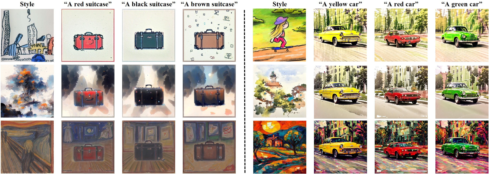

<p align="center">
<<<<<<< HEAD
  <h1 align="center">
  StyleStudio: Text-Driven Style Transfer with Selective Control of Style Elements<br>
  <small>CVPR 2025</small>
  </h1>
=======
  <h1 align="center">StyleStudio: Text-Driven Style Transfer with Selective Control of Style Elements<br><small>CVPR 2025</small></h1>
>>>>>>> a1bb47f03781400fae21bb19786452bb1851512c
  <p align="center">
    <a href="https://github.com/MingkunLei"><strong>Mingkun Lei</strong></a><sup>1</sup>
    &nbsp;&nbsp;
    <a href="https://scholar.google.com/citations?user=M6CSZVsAAAAJ&hl=zh-CN&oi=ao"><strong>Xue Song</strong></a><sup>2</sup>
    &nbsp;&nbsp;
    <a href="https://beierzhu.github.io/"><strong>Beier Zhu</strong></a><sup>1, 3</sup>
    &nbsp;&nbsp;
    <a href="https://wanghao.tech/"><strong>Hao Wang</strong></a><sup>4</sup>
    &nbsp;&nbsp;
    <a href="https://icoz69.github.io/"><strong>Chi Zhang</strong></a><sup>1✉</sup>
    <br>
    <sup>1</sup>AGI Lab, Westlake University,</span>&nbsp;
    <sup>2</sup>Fudan University,</span>&nbsp;
    <sup>3</sup>Nanyang Technological University</span>&nbsp;
    <br>
    <sup>4</sup>The Hong Kong University of Science and Technology (Guangzhou)</span>&nbsp;
    <br>
    <a href='https://arxiv.org/abs/2412.08503'></a>&nbsp;
    <a href='https://stylestudio-official.github.io/'></a>&nbsp;
    <a href="https://huggingface.co/spaces/Westlake-AGI-Lab/StyleStudio"></a>
    <br>
    
  </p>
  <br>
</p>

## News and Update
- __[2024.12.12]__ 🔥🔥We release the code.
- __[2024.12.19]__ 📝📝We have summarized the recent developments in [style transfer](https://github.com/MingkunLei/Awesome-Style-Transfer-with-Diffusion-Models). And we will continue to update.

## Abstract
Text-driven style transfer aims to merge the style of a reference image with content described by a text prompt.  Recent advancements in text-to-image models have improved the nuance of style transformations, yet significant challenges remain, particularly with overfitting to reference styles, limiting stylistic control, and misaligning with textual content.
In this paper, we propose three complementary strategies to address these issues. First, we introduce a cross-modal Adaptive Instance Normalization (AdaIN) mechanism for better integration of style and text features, enhancing alignment. Second, we develop a Style-based Classifier-Free Guidance (SCFG) approach that enables selective control over stylistic elements, reducing irrelevant influences. Finally, we incorporate a teacher model during early generation stages to stabilize spatial layouts and mitigate artifacts. 
Our extensive evaluations demonstrate significant improvements in style transfer quality and alignment with textual prompts.  Furthermore, our approach can be integrated into existing style transfer frameworks without fine-tuning.

## Getting Started
### 1.Clone the code and prepare the environment
```bash
git clone https://github.com/Westlake-AGI-Lab/StyleStudio
cd StyleStudio

# create env using conda
conda create -n StyleStudio python=3.10
conda activate StyleStudio

# install dependencies with pip
# for Linux and Windows users
pip install -r requirements.txt
```

### 2.Run StyleStudio

Please note: Our solution is designed to be **fine-tuning free** and can be combined with different methods.

#### Parameter Explanation
- `adainIP` 
using the cross modal AdaIN
- `fuSAttn`
hijack Self-Attention Map in the Teacher Model
- `fuAttn`
hijack Cross-Attention Map in the Teacher Model
- `end_fusion`
define when the Teacher Model stops participating
- `prompt`
specified prompt for generating the image
- `style_path`
path to the style image or folder
- `neg_style_path`
path to the negative style image
#### Integration with CSGO
Follow [CSGO](https://github.com/instantX-research/CSGO) to download pre-trained checkpoints.

This is an example of usage: as the value of `end_fusion` increases, the style gradually diminishes. If the `num_inference_steps` are set to 50, we recommend setting `end_fusion` between 10 and 20. Typically, `end_fusion` should be set within the first 1/5 to 1/3 of the total `num_inference_steps`.

If you find that layout stability is not satisfactory, consider increasing the duration of the Teacher Model's involvement.

```bash
# Generate a single stylized image
# Use a specific text prompt and style image path
python infer_StyleStudio.py \
  --prompt "A red apple" \
  --style_path "assets/style1.jpg" \
  --adainIP \ # Enable Cross-Modal AdaIN
  --fuSAttn \ # Enable Teacher Model with Self Attention Map
  --end_fusion 20 \ # Define when the Teacher Model stop participating
  --num_inference_steps 50

# Check layout stability across different style images
# With the same text prompt and a set of style images
python infer_StyleStudio_layout_stability.py \
    --prompt "A red apple" \
    --style_path "path/to/style_images_folder" \
    --adainIP \ # Enable Cross-Modal AdaIN
    --fuSAttn \ # Enable Teacher Model with Self Attention Map
    --end_fusion 20 \ # Define when the Teacher Model stop participating
    --num_inference_steps 50
```

##### Note

1. As shown in Figure 15 of the paper, employing a Cross Attention Map in the Teacher Model does not ensure layout stability. We have also provided an interface `fuAttn` and encourage everyone to experiment with it.
2. To ensure layout stability and consistency for the same prompt under different style images, it is important to maintain consistency in the initial noise $z_0$ during experiments. For more details on this aspect, refer to `infer_StyleStudio_layout_stability.py`.


This is an example of using Style-based Classifier-Free Guidance. 
```bash
python infer_StyleStudio.py \
  --prompt "A red apple" \
  --style_path "assets/style2.jpg" \
  --neg_style_path "assets/neg_style2.jpg" \
```
Some recommendations for generating Negative Style Images.
- You can use [ControlNet Canny](https://huggingface.co/xinsir/controlnet-canny-sdxl-1.0) for generation.
- To ensure the generated images are more realistic, you can use weights from Civitai or Huggingface that are better suited for generating realistic image effects. We use the [RealVisXL_V4.0](https://huggingface.co/SG161222/RealVisXL_V4.0).

To generate negative style images, we provide a code implementation in `example_create_neg_style.py` for your reference.

#### Integration with InstantStyle
Follow [InstantStyle](https://github.com/instantX-research/InstantStyle) to download pre-trained checkpoints.
```bash
python infer_InstantStyle.py \
  --prompt "A red apple" \
  --style_path "assets/style1.jpg" \
  --adainIP \ # Enable Cross-Modal AdaIN
  --fuSAttn \ # Enable Teacher Model with Self Attention Map
  --end_fusion 20 \ # Define when the Teacher Model stop participating
  --num_inference_steps 50
```

#### Integration with StyleCrafter
Follow [StyleCrafter](https://github.com/GongyeLiu/StyleCrafter-SDXL) to download pre-trained checkpoints.

We encourage you to integrate the Teacher Model with StyleCrafter. This combination, as shown in our experiments, not only helps maintain layout stability but also effectively reduces content leakage.
```bash
cd stylecrafter_sdxl

python stylecrafter_teacherModel.py \
  --config config/infer/style_crafter_sdxl.yaml \
  --style_path "../assets/style1.jpg" \
  --prompt "A red apple" \
  --scale 0.5 \
  --num_samples 2 \
  --end_fusion 10 # Define when the Teacher Model stop participating
```

### 3. Demo
To run a local demo of the project, run the following:
```bash
python gradio/app.py
```


## Related Links
* [Style Transfer with Diffusion Models](https://github.com/MingkunLei/Awesome-Style-Transfer-with-Diffusion-Models): A paper collection of recent style transfer methods with diffusion models.
* [CSGO: Content-Style Composition in Text-to-Image Generation](https://github.com/instantX-research/CSGO)
* [InstantStyle: Free Lunch towards Style-Preserving in Text-to-Image Generation](https://github.com/instantX-research/InstantStyle)
* [StyleCrafter-SDXL](https://github.com/GongyeLiu/StyleCrafter-SDXL)
* [IP-Adapter: Text Compatible Image Prompt Adapter for Text-to-Image Diffusion Models](https://github.com/tencent-ailab/IP-Adapter)

## BibTeX
If you find our repo helpful, please consider leaving a star or cite our paper :)
```bibtex
@misc{lei2024stylestudiotextdrivenstyletransfer,
      title={StyleStudio: Text-Driven Style Transfer with Selective Control of Style Elements}, 
      author={Mingkun Lei and Xue Song and Beier Zhu and Hao Wang and Chi Zhang},
      year={2024},
      eprint={2412.08503},
      archivePrefix={arXiv},
      primaryClass={cs.CV},
      url={https://arxiv.org/abs/2412.08503}, 
}
```


## 📭 Contact
If you have any comments or questions, feel free to contact [Mingkun Lei](leimingkun@westlake.edu.cn).
